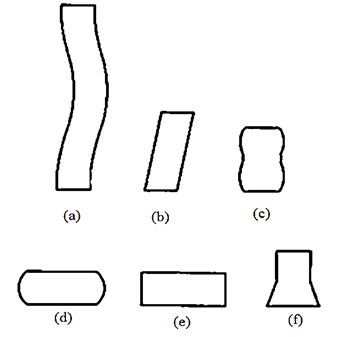

In compression test the material experiences opposing forces that push inward upon the specimen from opposite sides or is otherwise compressed, squashed, crushed, or flattened. The test sample is generally placed in between two hard metal bearing blocks that distribute the applied load across the entire surface area of two opposite faces of the test sample and then the plates are pushed together by a universal testing machine causing the sample to flatten. A sample will get shortened in the direction of the applied forces and expands in the direction perpendicular to the force.

Certain materials subjected to a compressive force show initially a linear relationship between stress and strain.

The Hooke's Law states that,

E = Stress(s)/Strain(e)

Where E is Young's modulus. This value represents how much the material will deform under applied compressive loading before plastic deformation occurs. A material's ability to return to its original shape after deformation has occurred is referred to as its elasticity. At certain force the permanent or plastic deformation will occur, this is known as proportional limit. At this point the linear behaviour of graph stops. The force at which the material begins exhibiting this behaviour is called the yield point or yield strength. A specimen will then exhibit one of two types of behaviour, either it will continue to deform until it eventually breaks or it will distort until flat. In either case a maximum stress or force will be evident providing its ultimate compressive strength value.

In compression test the properties such as elastic limit, proportional limit, yield point, yield strength, and (for some materials) compressive strength, modulus of elasticity, secant modulus, tangent modulus are determined. Some materials do not exhibit a yield point; in such cases an offset yield point (proof stress) is arbitrarily defined. The value for this is commonly set at 0.2% plastic strain. From that plot the elastic modulus, secant modulus, tangent modulus are found out.

The elastic modulus is the ratio of stress to corresponding strain below the proportional limit of the material. Secant modulus is the ratio of stress to strain at any point on curve in a stress-strain diagram, obtained by the slope of a line from the origin to any point on a stress-strain curve. Then tangent modulus is the slope of the stress strain curve at any specified stress or strain. Below the proportional limit the tangent modulus is equivalent to Young's modulus. Above the proportional limit the tangent modulus varies with strain.

**Modes of deformation in compression testing**

The figure below illustrates the different modes of failure in compression testing.

1. when L/D > 5,Buckling
2. when L/D > 2.5, Shearing
3. when L/D > 2.0 and friction is present at the contact surfaces,Double barrelling
4. when L/D < 2.0 and friction is present at the contact surfaces, Barrelling
5. when L/D < 2.0 and no friction is present at the contact surfaces, Homogenous compression.
6. Compressive instability due to work-softening material.

**Failure patterns**:

Ductile material will have proportional limit in compression very close to those in tension. The initial regions of their compression stress strain diagram are very similar to tension diagrams. When a mild steel specimen is compressed, it begins to bulge outward on the sides and become barrel shaped. With increasing load the specimen is flattened out, thus offering increased resistance to further shortening.

**RELEVANT INDIAN STANDARD FOR COMPRESSION TEST**:

1. IS 13780 (1993): Hardmetals - Compression Test.
