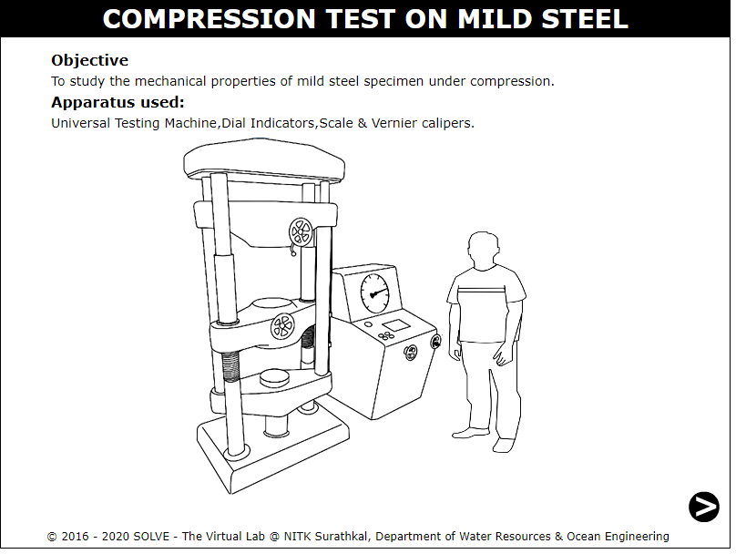
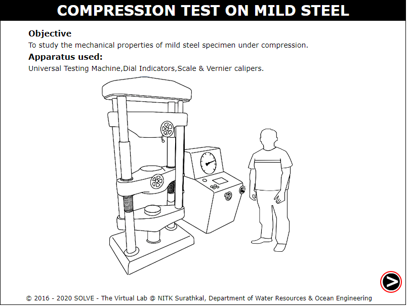
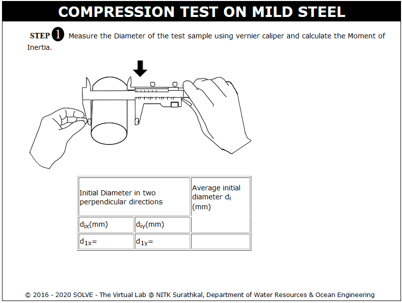
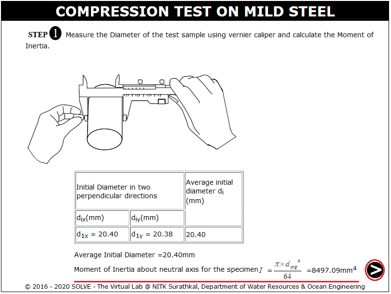
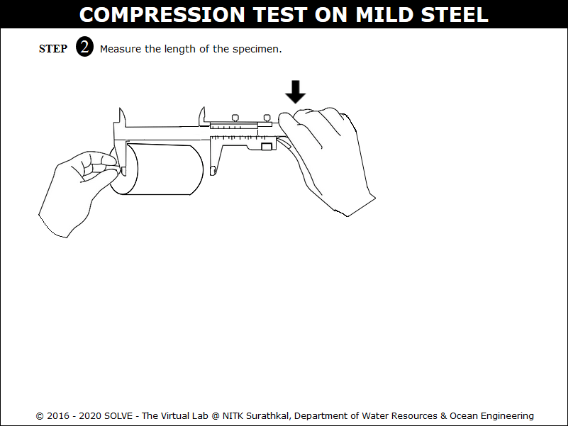
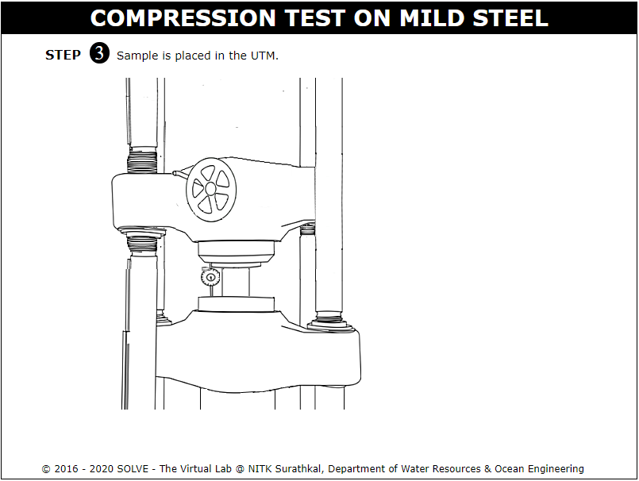
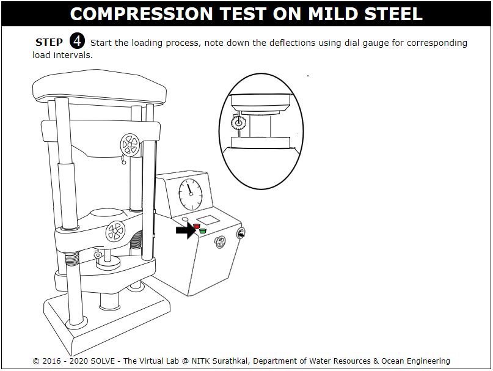
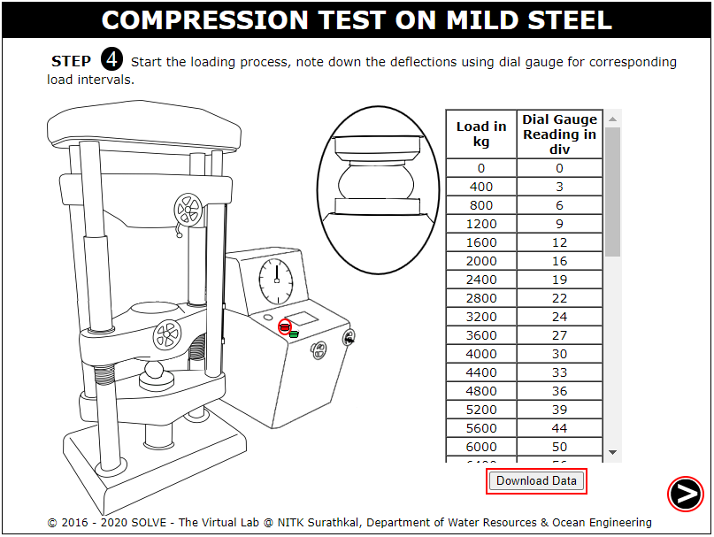
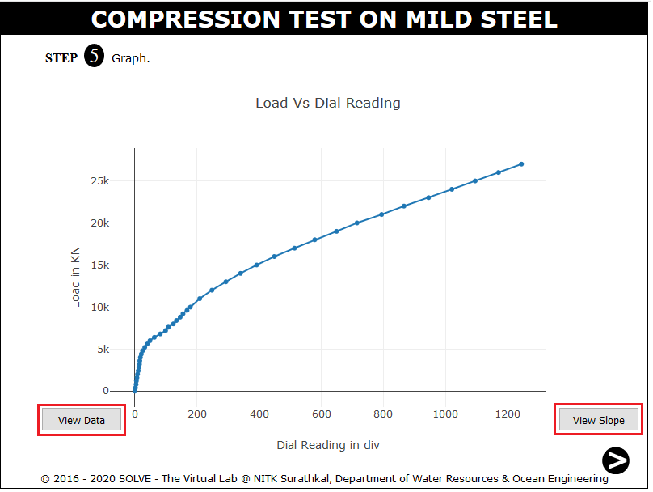
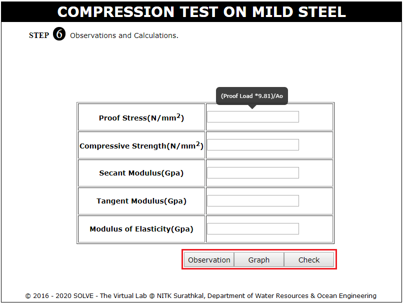

**OBJECTIVE**:

To study the mechanical properties of Mild Steel specimen under compression.

**STEPS**:

1. When you click on Compression Test on cast iron file a window will open as shown below.  
   

2. Click on the NEXT button to move to the next step.  
   

3. Measure the Diameter of the test sample using vernier caliper.  
   

4. Calculate the Moment of Inertia using average initial diameter.  
   

5. Measure the length of the specimen.  
   

6. Sample is dragged to be placed in the UTM and a dial gauge is mounted, click on dial gauge adjusting knob to set it to zero.  
   

7. Start the loading process.  
   

8. Note down the deflections using dial gauge for corresponding load intervals as the specimen fails the loading is stopped by clicking on the red button. There is option to download the dial gauge reading.  
   

9. Calculate the result based on the test value and enter in the given box. To check the calculated value click on CHECK.  
   

10. Observation of second trial.  
    
